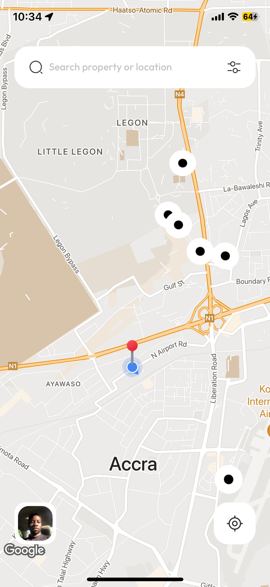
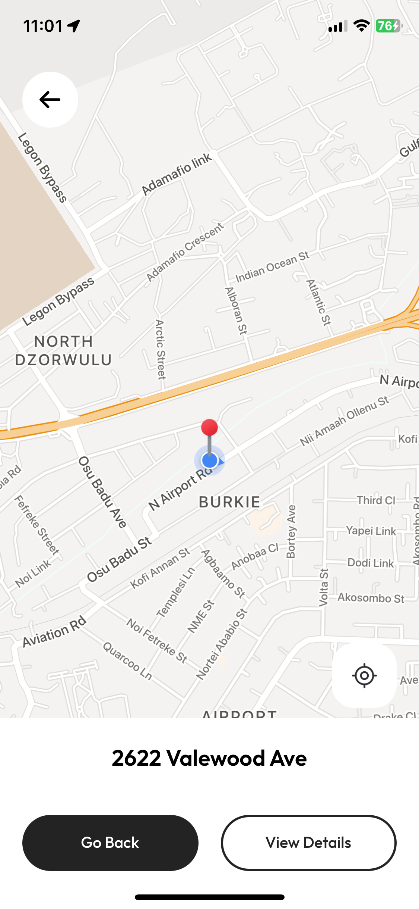
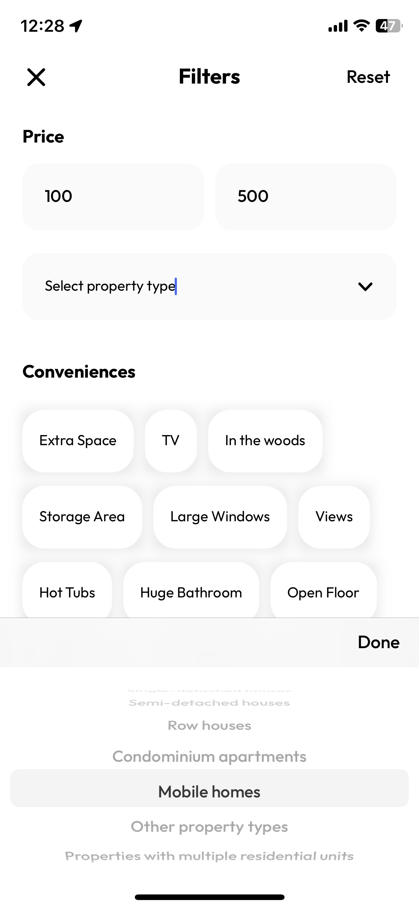
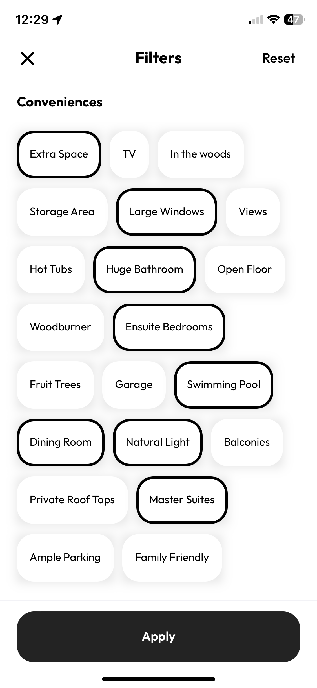
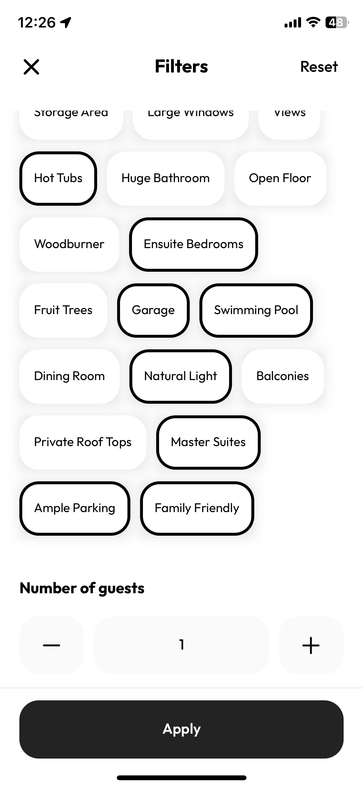
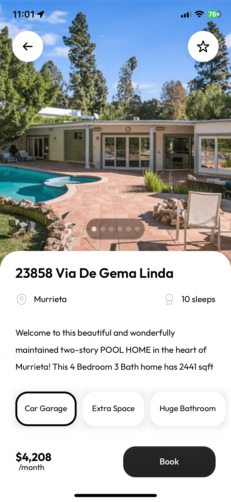

# Rental Property

Created this project to build a rental property concept on [Here](https://dribbble.com/shots/18688887-Rental-Property-Finder-App)

* The first screen is a map that displays the location of the suitable apartments.  with maps helps users to visualize the location of the desired house or flat. The interface is full of filters that make it easier to find a suitable apartment.
* The property detail screen displays the main info about the apartments: their location, price, size, and description. 
* The third screen displays filters.

The color scheme of this concept is light and airy. The combination of white and black finely combines with colorful apartment pictures and the map.

### Note ⚙️
The application was built using: 
* Xcode 14.2
* Swift 5.7.2
* 

### Core Technologies 📲
* Swift
* UIKit (Programmatic approach)
* Protocol Delegation
* Google Maps Sdk [Link](https://developers.google.com/maps/documentation/ios-sdk/overview)
* AlignedCollectionViewFlowLayout [Link](https://github.com/mischa-hildebrand/AlignedCollectionViewFlowLayout)
* CHIPageControl [Link](https://github.com/ChiliLabs/CHIPageControl)

# Screenshots

